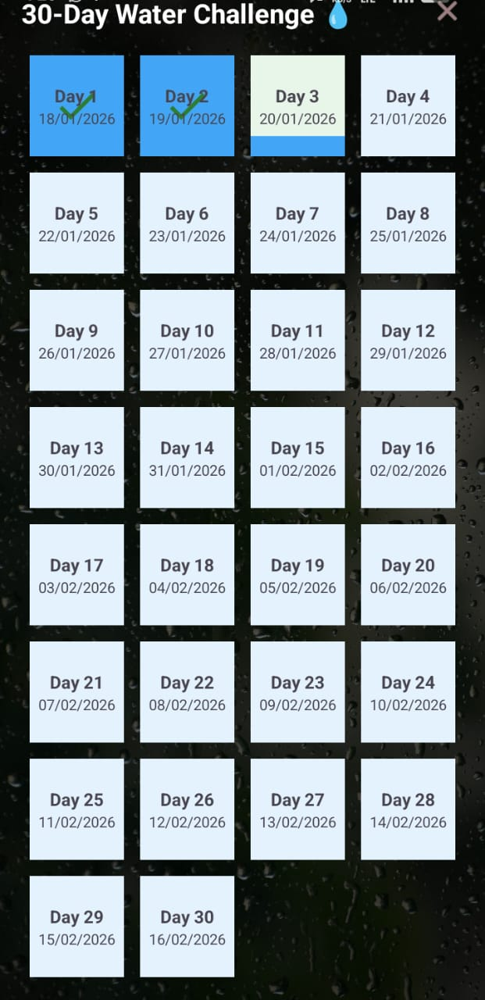
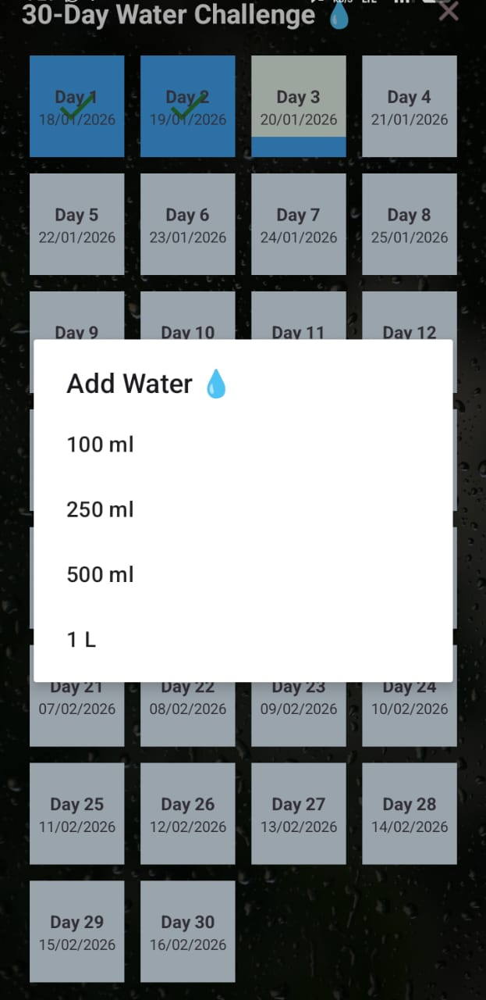
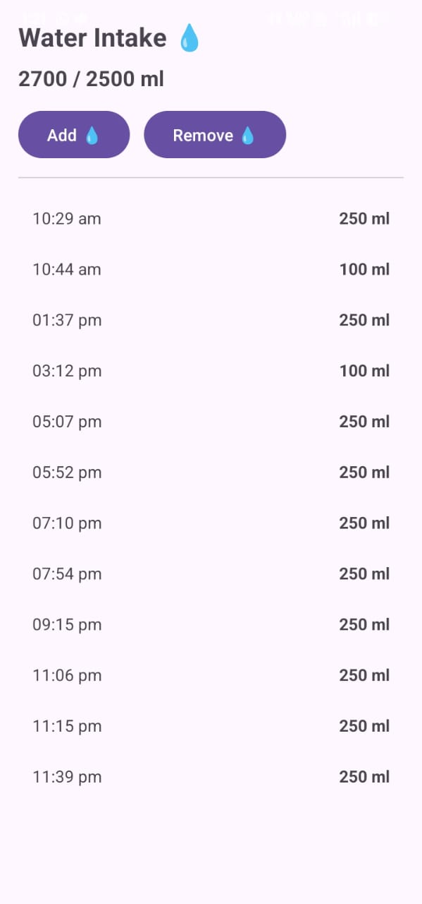

<h1 align="center">💧 Hydro30</h1>

  <b>30-Day Water Intake Tracking Android Application</b> 
  Build a healthy hydration habit with consistency.

  
  
  

<h2>📖 About the App</h2>

Water is one of the most essential needs of the human body, yet it is often ignored
in our daily routine. Proper hydration helps maintain energy levels, supports digestion,
keeps the skin healthy, and improves overall physical and mental performance.

Water deficiency or dehydration can lead to common problems such as fatigue,
headaches, poor concentration, and reduced productivity. Despite knowing this,
many people forget to drink enough water consistently throughout the day.

<b>Hydro30</b> was created as a simple personal solution to fix this habit.
The idea was to design a minimal and distraction-free app that encourages
daily water intake through a structured <b>30-day challenge</b>.

This project was originally built for personal use and learning purposes,
and later uploaded to GitHub so that anyone who wants to improve their hydration
habits can use it, modify it, or extend it according to their needs.

<h2>⚙️ How the App Works</h2>

When the user opens the app for the first time, they are welcomed with a setup screen
that asks them to select a <b>starting date</b> for the hydration challenge.
After selecting the date, the user can accept and start the <b>30-day water intake challenge</b>.

Once the challenge is accepted, the app displays a grid of <b>30 blocks</b>,
each representing one day of the challenge. The challenge timeline begins from
the selected starting date, and each block corresponds to consecutive days.

The user can add water intake only for the <b>current day</b>.
To add water, the user needs to <b>long-press</b> on today’s block.
This opens a dialog with predefined water quantity options:
<b>100 ml, 250 ml, 500 ml, and 1 litre</b>.

When a quantity is selected, the water level inside the day’s block visually increases,
giving a clear indication of progress. The app allows water intake to be added
until a maximum limit of <b>2.5 litres per day</b>, helping users maintain a healthy balance.

By simply tapping on any day’s block, the user can view the <b>water intake logs</b>
for that day. This helps track when and how much water was consumed throughout the day.

The challenge automatically completes after <b>30 days</b> from the selected start date.
If the user wishes to end the challenge before completion, an option is available
in the <b>top-left corner</b> of the app to close or exit the ongoing challenge.

This flow keeps the app simple, focused, and easy to use, encouraging users
to stay consistent without overwhelming them with unnecessary features.

<h2>✨ Key Features</h2>

<ul>
  <li>30-day structured water intake challenge</li>
  <li>Simple water quantity selection</li>
  <li>Daily progress tracking</li>
  <li>Clean and minimal UI design</li>
  <li>User-friendly and beginner-focused experience</li>
</ul>

<h2 align="center">📸 App Preview</h2>

  
  
  

  <i>Challenge setup, water intake tracking, and daily logs overview</i>

<h2>🛠️ Tech Stack</h2>

<ul>
  <li><b>Language:</b> Kotlin</li>
  <li><b>IDE:</b> Android Studio</li>
  <li><b>UI Design:</b> XML</li>
  <li><b>Platform:</b> Android</li>
</ul>

---

<h2>🚀 How to Run the Project</h2>

<pre>
git clone https://github.com/shrey-space/Hydro30.git
</pre>

<ol>
  <li>Open the project in <b>Android Studio</b></li>
  <li>Allow Gradle to sync completely</li>
  <li>Run the app on an emulator or physical Android device</li>
</ol>

<h2>👨‍💻 Author</h2>

<b>Shrey</b> 
Software & Full-Stack Development Enthusiast 
GitHub: <a href="https://github.com/shrey-space">shrey-space</a>

⭐ If you find this project useful, consider starring the repository.

